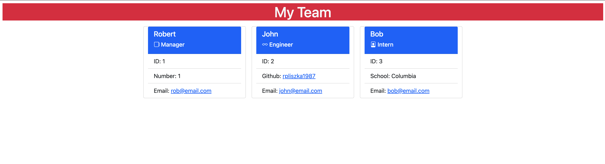

# Team Profile Generator

## Description

This is a user prompt application which creates team members for a company. You start out creating a Manager followed by addinng additional Employee's such as: Engineer or Intern. Omnce you are done your staff directory is created. This is done using the Inquirer npm package to ask user for their chosen input. There is also use of Object Oriented Programing (OOP) and Test Driven Development (TDD). Project is also using Classes which are used to create Employee's for the HTML generated website which is located in the dist directory after the prompt is ran. Manager will get a full HTML site with layout and all employees listed.

## Table of Content

- [Installation](#installation)
- [Usage](#usage)
- [Test](#test)
- [Manager-Intput](#manager-input)
- [Engineer-Input](#engineer-input)
- [Intern-Input](#intern-input)
- [Demo-Video](#demo-video)
- [GitHub](#github)
- [Screenshot](#screenshot)

## Installation

- Git clone the application
- Run $npm install

## Usage

This application is used to create employee database.

## Test

Run $npm run test

## Manager-Input

- name
- id
- email

## Engineer-Input

- name
- id
- email
- github username

## Intern-Input

- name
- id
- email
- school name

## GitHub

Repo Url - https://github.com/rpliszka1987/team-profile-generator

## Demo-Video

https://drive.google.com/file/d/1EWsbOSpQBFnZDnE7lON2TV6-uCKZv1fE/view

## Screenshot

